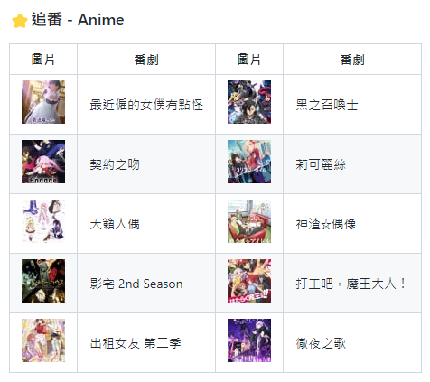

<h1 align="center">README 追番列表</h1>
<p align="center">
自動更新 README 追番列表的 GitHub Action 套件
</p>
<br />
<p align="center">

</p>
<br />

## 使用

首先要註冊一個 [Bangumi](http://bangumi.tv/) 的帳號，然後複製現有的 `README.md` 到 `template/README-eta.md`，在想要放列表的地方貼上以下：

```
| 圖片 | 番劇 |
| --- | --- |
<% it.data.forEach(function (anime) { %>
|  | <%= anime.subject.name_cn %> |
<% }) %>
```

模板引擎是使用 [eta](https://github.com/eta-dev/eta)，而可以使用的資料來源則是 Bangumi API 的 [獲取用戶收藏](https://bangumi.github.io/api/#/%E6%94%B6%E8%97%8F/getUserCollectionsByUsername)，可以自行查詢可使用的資料。

這裡示範使用2欄的表格：

```
| 圖片 | 番劇 | 圖片 | 番劇 |
| --- | --- | --- | --- |
<% it.data.forEach(function (anime, index) { %><%= index % 2 == 0 ? '|' : '' %>  | <%= anime.subject.name_cn %> |<%= index % 2 == 1 ? '\n' : '' %><% }) %>
```

最後增加一個 workflow 檔，把 `bangumi_username` 改成你的 Bangumi 用戶名稱或 uid，`user_agent` 改成 `[你的GitHub名稱]/[你的GitHub倉庫] README`：

*.github/workflows/anime_list.yml*
```yaml
name: Update README

on:
  push:
  schedule:
    - cron: '0 */1 * * *'

jobs:
  anime_list:
    runs-on: ubuntu-latest
    steps:
      - uses: actions/checkout@v3

      - uses: ycs77/readme-anime-list@main
        with:
          target: 'README.md'
          template: 'template/README-eta.md'
          bangumi_username: '715333'
          bangumi_limit: 10
          user_agent: 'ycs77/ycs77 README'

      - name: Commit
        uses: EndBug/add-and-commit@v4
        with:
          message: 'Update generated README'
        env:
          GITHUB_TOKEN: ${{ secrets.GITHUB_TOKEN }}
```

> `secrets.GITHUB_TOKEN` 不需要特別去增加，預設就會有的。

## Inputs

### `target`

**Required** 目標 README 檔。

### `template`

**Required** README 模板檔案。

### `bangumi_username`

**Required** Bangumi 用戶名稱或 uid。

### `bangumi_limit`

預設值：`10`

列表項目數量。

### `user_agent`

預設值：`"ycs77/readme-anime-list"`

給 Bangumi API 看的 User-Agent 值，參考：[關於 User-Agent](https://github.com/bangumi/api/blob/master/docs-raw/user%20agent.md)。

## Config

在倉庫根目錄下增加 `readme-anime-list.config.json`，可以增加一些比較複雜的設定。

### `replace`

替換標題文字，可以改成自己比較喜歡的翻譯。左邊是 Bangumi 原有的文字，右邊是可以自己設定的翻譯：

```json
{
  "replace": {
    "莉可丽丝": "莉可麗絲",
    "神渣☆爱豆": "神渣☆偶像"
  }
}
```

## License
Under the [MIT LICENSE](LICENSE)
